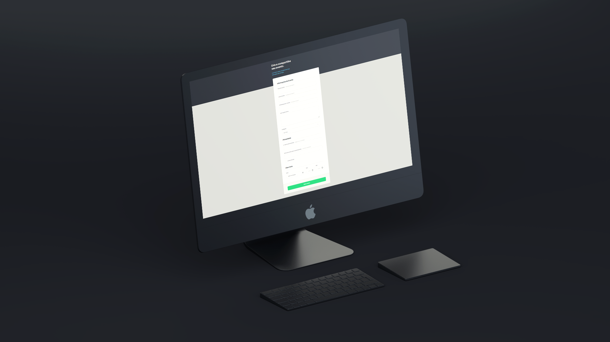

  
  

## 🖥️ Projeto

Esse é um projeto de formulário para criação de evento.

## 🚀 Tecnologias

Esse projeto foi desenvolvido durante o curso Explorer da Rocketseat com as seguintes tecnologias:

- HTML
- CSS
- Git e Github

## 💡 Conhecimentos Adquiridos

- Utilização de content no body::before, configurando position e z-index.
- Método POST no formulário.
- Customização do Checkbox.
- Customização do input inválido para melhor identificação do usuário.
- Configuração de input em 3 colunas inline, utilizando o método nth(child).